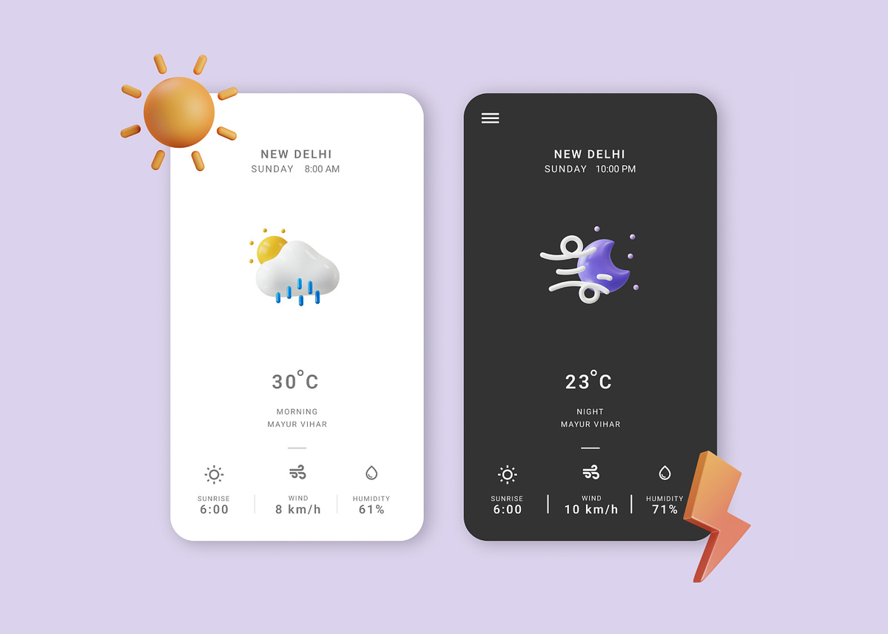

# WeatherUi

## Work with Angular 

### Getting Started

Do work with Angular please install first the Angular CLI globally:

```bash
npm install -g @angular/cli
```

### Development server

Run `ng serve` for a dev server. Navigate to `http://localhost:4200/`. 
The application will automatically reload if you change any of the source files.

## Task

### Component
First create a component `weather` with the following requirements and a design which looks like the following:



The component should have: 
- an input field where the user can enter a city name
- a button to submit the city name
- if possible a picture of the current weather
- a label with the current temperature
- a label for wind speed, wind direction and humidity
- feel free to add more data if the api provides more data

To see if your component works, 
create a weather model and fill it with some custom values. 
We will adjust this model and fill the data later using a service.

### Service

For getting the weather data we will use the [OpenWeatherMap API](https://openweathermap.org/current)
Please create a profile on the website and get an API key.

U can test the API with the following URL:
```bash
# for example the current weather in Berlin using metric units 
curl --location 'https://api.openweathermap.org/data/2.5/weather?appid=<YOUR_APP_ID>&units=metric&q=Berlin'
```

To use your service in your component, please inject it in the constructor of your component.
Then after filling the input field, send a request to the api and show the result on the UI.

### Bonus

- Show the current weather image on the UI (visit the [OpenWeatherMap Weather-Conditions](https://openweathermap.org/weather-conditions) for more information and examples)
- Add a loading spinner while the request is in progress
- Add a error message if the request fails
- Add a button to change the temperature unit (metric, imperial, kelvin)


### Example for Berlin
If you send a request for Berlin, you should get the following response. 
You can directly use this Schema for your WeatherDto Model.

```json
{
    "coord": {
        "lon": 13.4105,
        "lat": 52.5244
    },
    "weather": [
        {
            "id": 803,
            "main": "Clouds",
            "description": "broken clouds",
            "icon": "04d"
        }
    ],
    "base": "stations",
    "main": {
        "temp": 14.94,
        "feels_like": 14.66,
        "temp_min": 12.83,
        "temp_max": 16.67,
        "pressure": 1009,
        "humidity": 83
    },
    "visibility": 10000,
    "wind": {
        "speed": 5.66,
        "deg": 260
    },
    "clouds": {
        "all": 75
    },
    "dt": 1696509839,
    "sys": {
        "type": 2,
        "id": 2011538,
        "country": "DE",
        "sunrise": 1696482803,
        "sunset": 1696523773
    },
    "timezone": 7200,
    "id": 2950159,
    "name": "Berlin",
    "cod": 200
}
```
